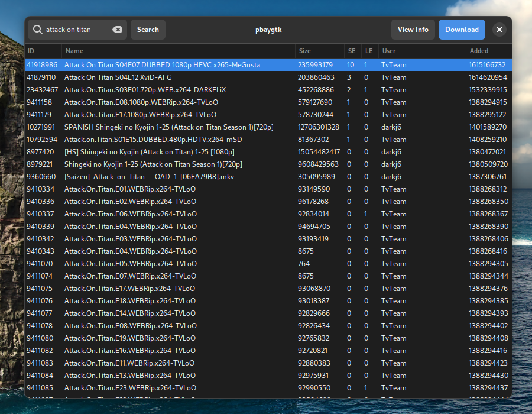
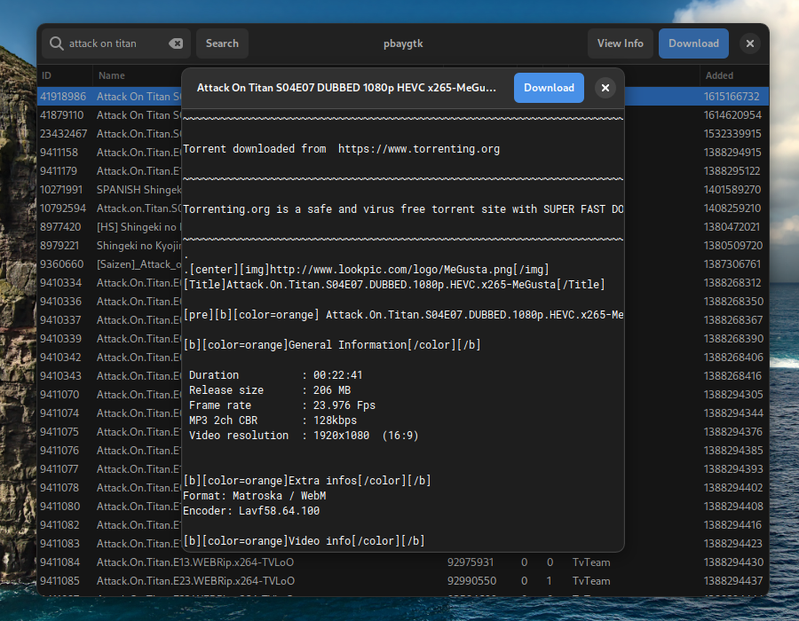

# pbaygtk v0.0.1

Gtk3 Wrapper around [thepiratebay.org](https://thepiratebay.org/)'s API. 
Turns out, ISPs didn't ban the actual API allowing us to access it via this 
wrapper.

Use the original [pbay](https://github.com/xAspirus/pbay) for a command-line
alternative which works on all platforms.

## Screenshots

## Installation

### Linux and BSDs
* `git clone https://github.com/aspizu/pbaygtk.git ~/Downloads/Src/pbaygtk-git` Clone the git repository
* `cd ~/Downloads/Src/pbaygtk-git` CD into the repository folder 
* Run [linux_install.sh](linux_install.sh) to install locally

### Windows
Does GTK even work under windows?

### macOS
Don't have a mac yet.
